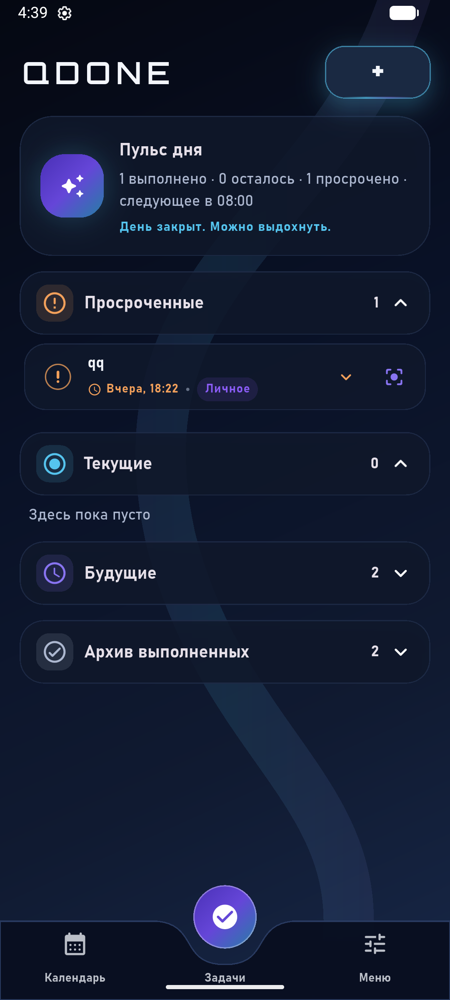
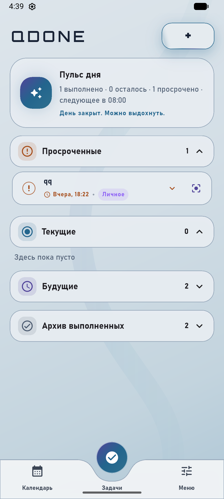
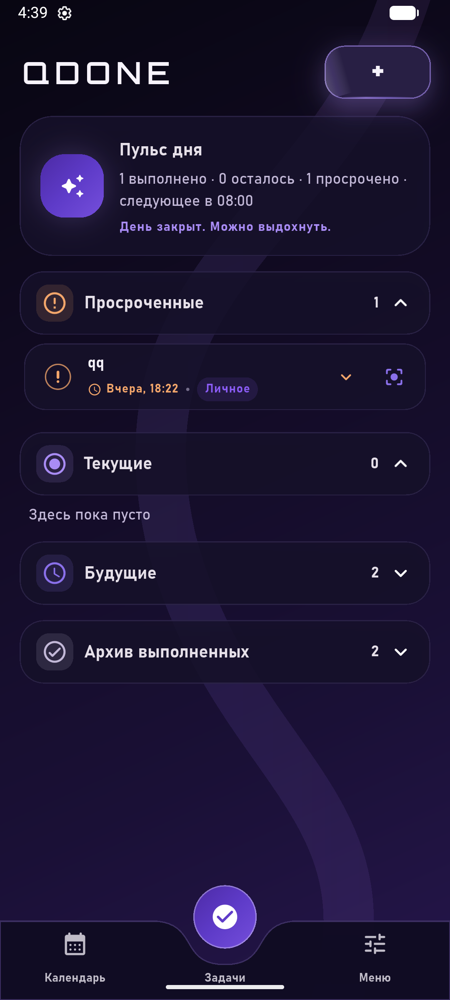
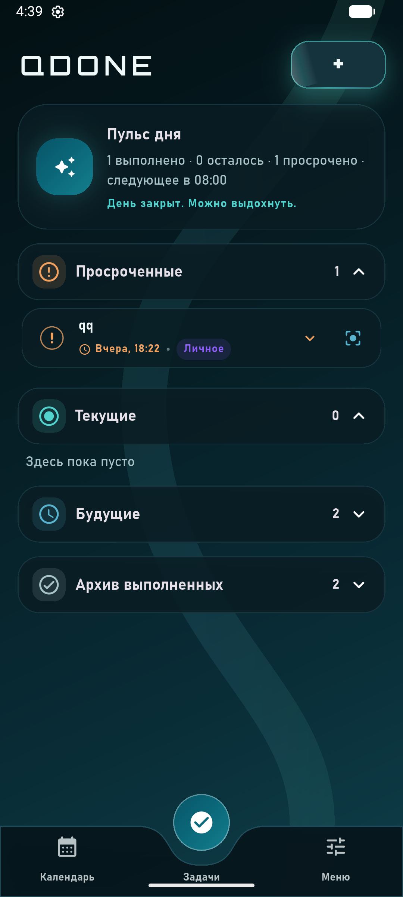
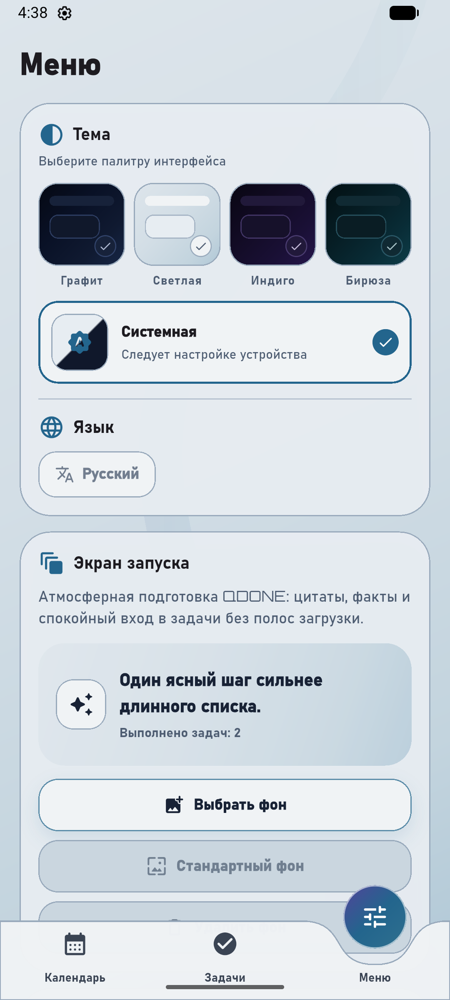

# QDone

> Быстрый персональный планировщик на Flutter: задачи, календарь, повторения,
> локальные напоминания и Android-виджет без облачной зависимости.


**QDone** — русскоязычное кроссплатформенное приложение для личного
планирования от **VolkoWeb studio**. Оно объединяет компактный список задач,
календарь, повторяющиеся дела, гибкие напоминания, локальное хранение и
нативный Android-виджет.

Версия **0.5.3+53** рассчитана на стабильную работу с большими списками:
задачи хранятся в SQLite через Drift, экран использует ленивые sliver-списки и
пагинацию, а системные уведомления ограничены безопасным глобальным бюджетом.

## Интерфейс и темы

В приложении доступны четыре самостоятельные палитры и системный режим.
Палитры построены на общих семантических токенах, поэтому поверхности,
текст, статусы, формы, кнопки и навигация сохраняют контролируемый контраст.

<table>
  <tr>
    <th>Графит</th>
    <th>Светлая</th>
    <th>Индиго</th>
    <th>Бирюза</th>
  </tr>
  <tr>
    <td></td>
    <td></td>
    <td></td>
    <td></td>
  </tr>
</table>

Выбор темы оформлен визуальными карточками. Отдельная системная карточка
автоматически следует светлому или тёмному режиму устройства.

<p align="center">
  
</p>

Переключение палитры выполняет только единичную перестройку интерфейса. Новые
темы не добавляют фоновых процессов, изображений или тяжёлых blur-эффектов и
не создают постоянной нагрузки на FPS.

## Возможности

| Направление | Реализация |
| --- | --- |
| Задачи | приоритет, энергия, категория, описание, статусы, архив, восстановление, перенос и snooze |
| Компактный список | сворачиваемые карточки, быстрые действия, focus mode и ленивый `SliverList` |
| Календарь | видимый месяц и выбранный день без чтения всей базы |
| Повторения | ежедневно, еженедельно, ежемесячно, ежегодно, свои интервалы и несколько времён в день |
| Напоминания | локальные уведомления, exact/inexact fallback, автоматическое восстановление расписания |
| Виджет | нативный Android home widget на Kotlin, быстрые действия и синхронизация цветового акцента |
| Импорт и экспорт | актуальный backup-формат и совместимость со старыми JSON-файлами QDone |
| Брендинг | Orbitron для токенов `QDone`/`QDONE`, Bahnschrift для основного текста |

## Производительность

- Задачи хранятся в индексированной SQLite-базе через `drift`.
- Экран получает страницы по `50` записей через cursor pagination.
- Карточки создаются только для видимой области списка.
- Календарь, статистика, история и виджет используют ограниченные SQL-запросы.
- Для карточек применён `RepaintBoundary`; тяжёлые тени и blur убраны из
  прокручиваемых элементов.
- Тестовая база из `10 000` задач не загружается целиком в дерево виджетов.

## Уведомления

`NotificationScheduler` поддерживает ограниченное и идемпотентное расписание:

- не более `48` ожидающих системных alarms на всё приложение;
- горизонт планирования — `30` дней;
- максимум `4` ближайших события для одной задачи;
- `exactAllowWhileIdle` используется только при наличии Android-разрешения;
- без exact-разрешения применяется автоматический `inexactAllowWhileIdle`;
- расписание сверяется после изменения задачи, при запуске приложения,
  возврате из фона и каждые `12` часов через WorkManager.

При обновлении со старой версии устаревшие alarms очищаются и создаются заново
в пределах бюджета. Это предотвращает ошибку Android
`Maximum limit of concurrent alarms 500 reached`.

## Данные и совместимость

Основные таблицы Drift:

- `tasks`;
- `reminders`;
- `notification_schedule`;
- `metadata`.

Настройки приложения и компактный payload Android-виджета остаются в
`SharedPreferences`.

При первом запуске новой архитектуры QDone транзакционно переносит старые
данные `qdone.tasks.v1` из `SharedPreferences` в SQLite. Исходный JSON удаляется
только после успешной проверки количества записей. При ошибке импорт
откатывается, а исходные данные сохраняются.

Экспортированные старыми версиями JSON-файлы поддерживаются. Устаревшее поле
`notificationIds` принимается для совместимости, но новое расписание
уведомлений строится независимо от него. Перед импортом проверяются версия
схемы и дублирующиеся идентификаторы задач.

## Архитектура

```text
lib/
  app/                 providers, router, root widget
  core/                theme tokens, notifications, Drift database, shared UI
  features/
    tasks/             domain, repositories, recurrence, use cases, paged UI
    calendar/          limited calendar queries and presentation
    settings/          preferences, backup/import/export and menu UI
    home_widget/       Android widget synchronization contracts
  shared/              shell, components, extensions and common models
```

Feature-модули не зависят от представления друг друга. Настройки, база задач,
scheduler уведомлений и Android-виджет синхронизируются через отдельные
контракты и сервисы.

## Стек

- `flutter_riverpod` — состояние и dependency wiring.
- `go_router` — навигация.
- `drift`, `drift_flutter` — SQLite, миграции и реактивные запросы.
- `shared_preferences` — настройки и компактные платформенные payload.
- `flutter_local_notifications`, `timezone`, `flutter_timezone` — локальные
  уведомления и часовые пояса.
- `workmanager` — периодическое восстановление расписания.
- `home_widget` — мост между Flutter и Android-виджетом.
- `table_calendar` — календарный интерфейс.
- `flutter_animate` — короткие контролируемые анимации.

## Быстрый старт

```bash
flutter pub get
flutter run
```

Android debug-сборка:

```bash
flutter build apk --debug
```

## Проверка качества

```bash
flutter analyze
flutter test
flutter build apk --debug
git diff --check
```

Текущая проверка версии `0.5.3+53`:

- `flutter analyze` — без замечаний;
- `58` автоматических тестов — пройдены;
- Android debug APK — собран и установлен на эмулятор;
- протестированы scheduler, миграция старых данных, backup-совместимость,
  Kotlin-виджет, темы и ленивый список на `10 000` задач.

## Статус платформ

Основная приёмка текущего релиза ориентирована на Android. iOS продолжает
собираться, но отдельная platform-specific проверка уведомлений и фонового
расписания запланирована позднее.

На Huawei/HarmonyOS может потребоваться вручную разрешить уведомления, точные
будильники, autostart и фоновую активность для QDone. После обновления
рекомендуется один раз открыть приложение, чтобы расписание уведомлений было
восстановлено.

## English

**QDone** is a Russian-first Flutter personal planning app by
**VolkoWeb studio**. Version `0.5.3+53` provides Drift/SQLite persistence,
cursor-paginated task lists, bounded Android notification scheduling, legacy
JSON import compatibility, a native Kotlin home widget and four
contrast-controlled interface palettes.

## Лицензия

Проект распространяется по лицензии MIT. Подробности в [LICENSE.md](LICENSE.md).
